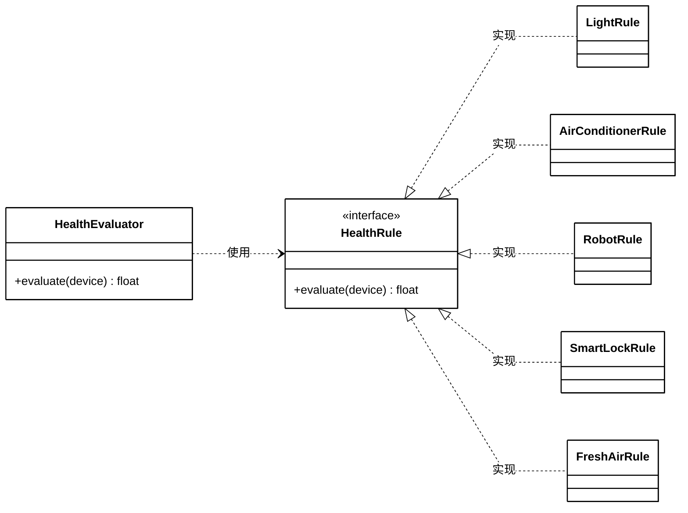

```mermaid
%%{init: {"theme": "base", "themeVariables": {"primaryColor": "#ffffff", "primaryTextColor": "#000000", "primaryBorderColor": "#000000", "lineColor": "#000000", "background": "#ffffff", "fontFamily": "Arial", "tertiaryColor": "#ffffff", "secondaryColor": "#ffffff", "edgeLabelBackground": "#ffffff"}, "flowchart": {"curve": "linear", "nodeSpacing": 65, "rankSpacing": 95}}}%%
classDiagram
    direction LR

    class HealthEvaluator {
        +evaluate(device) float
    }

    class HealthRule {
        <<interface>>
        +evaluate(device) float
    }

    class LightRule
    class AirConditionerRule
    class RobotRule
    class SmartLockRule
    class FreshAirRule

    HealthEvaluator ..> HealthRule : 使用

    HealthRule <|.. LightRule : 实现
    HealthRule <|.. AirConditionerRule : 实现
    HealthRule <|.. RobotRule : 实现
    HealthRule <|.. SmartLockRule : 实现
    HealthRule <|.. FreshAirRule : 实现

    style HealthEvaluator fill:#ffffff,stroke:#000000,stroke-width:1.5px,color:#000000
    style HealthRule fill:#ffffff,stroke:#000000,stroke-width:1.5px,color:#000000
    style LightRule fill:#ffffff,stroke:#000000,stroke-width:1.5px,color:#000000
    style AirConditionerRule fill:#ffffff,stroke:#000000,stroke-width:1.5px,color:#000000
    style RobotRule fill:#ffffff,stroke:#000000,stroke-width:1.5px,color:#000000
    style SmartLockRule fill:#ffffff,stroke:#000000,stroke-width:1.5px,color:#000000
    style FreshAirRule fill:#ffffff,stroke:#000000,stroke-width:1.5px,color:#000000
```