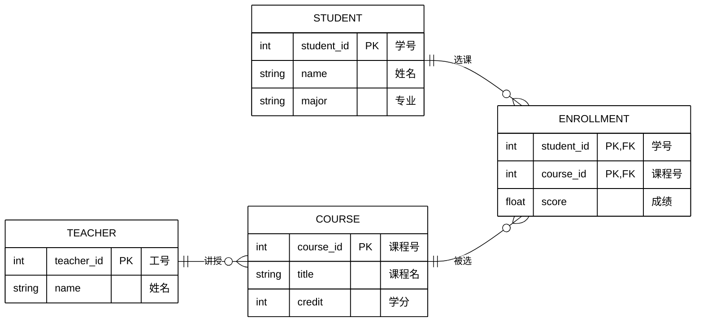

```mermaid
%%{init: {"theme": "base", "themeVariables": {"primaryColor": "#ffffff", "primaryTextColor": "#000000", "primaryBorderColor": "#000000", "lineColor": "#000000", "background": "#ffffff", "fontFamily": "Arial", "tertiaryColor": "#ffffff", "secondaryColor": "#ffffff", "edgeLabelBackground": "#ffffff", "attributeBackgroundColorOdd": "#ffffff", "attributeBackgroundColorEven": "#ffffff"}, "flowchart": {"curve": "linear", "nodeSpacing": 65, "rankSpacing": 95}}}%%
erDiagram
    direction LR

    STUDENT {
        int student_id PK "学号"
        string name "姓名"
        string major "专业"
    }

    COURSE {
        int course_id PK "课程号"
        string title "课程名"
        int credit "学分"
    }

    TEACHER {
        int teacher_id PK "工号"
        string name "姓名"
    }

    ENROLLMENT {
        int student_id PK, FK "学号"
        int course_id PK, FK "课程号"
        float score "成绩"
    }

    STUDENT ||--o{ ENROLLMENT : "选课"
    COURSE ||--o{ ENROLLMENT : "被选"
    TEACHER ||--o{ COURSE : "讲授"
```
